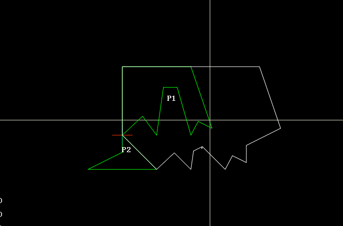
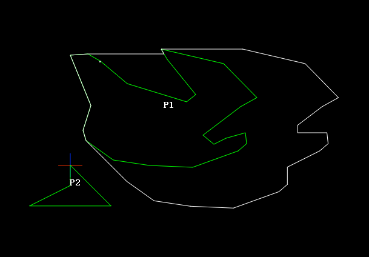
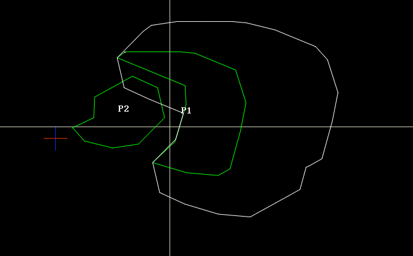
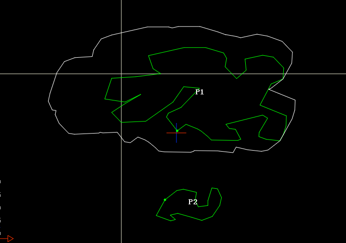

## QtCalcauteNFPs

QtCalcauteNFPs 是一个用于二维不规则多边形 NFP（No-Fit Polygon，临界多边形）计算与可视化验证的 Qt Widgets 工程。程序支持导入两个多边形，选择不同算法计算 NFP，并在界面中绘制结果和参考点运动动画。

## 功能

- 绘制输入多边形 P1、P2。
- 计算并绘制 NFP 闭合轮廓。
- 输出 P1、P2 顶点数据，便于复现问题样例。
- 支持动画演示 P2 参考点沿 NFP 轨迹绕 P1 运动。
- 支持在界面中选择不同 NFP 计算方法。

## NFP 算法

当前工程包含三种 NFP 计算方法：

1. 移动碰撞法

   通过接触状态推进 P2，沿可行移动方向逐段生成 NFP。该方法保留碰撞距离判断与后处理，适合观察接触推进过程。

2. 矢量段法

   基于论文中的“角-矢量边”思想生成候选轨迹线段，切分相交线段后按最小转角规则提取闭合 NFP 环。当前矢量段法主流程不再使用 Clipper 做边界碰撞校验，路径更接近论文流程：

   ```text
   generateCandidateSegments
   -> splitSegments
   -> extractRings
   -> finishNfpRings(sanitize=false, validateInnerStarts=false)
   ```

   调试输出会打印候选段数、切分段数、NFP 环数量以及各阶段耗时。

3. Minkowski 法

   使用 Clipper 的 `MinkowskiDiff` 计算 NFP，作为稳定性和结果对照方法。对于复杂凹多边形，可用该方法辅助验证矢量段法输出。

## 源码结构

NFP 相关代码已按算法拆分：

- `nest/nfpplacer.h`：NFP 计算器接口。
- `nest/nfpplacer.cpp`：基础构造、数据设置和结果获取。
- `nest/nfpplacer_common.h`：共享几何工具、候选段生成、线段切分、环提取、后处理。
- `nest/nfpplacer_moving.cpp`：移动碰撞法实现。
- `nest/nfpplacer_vector.cpp`：矢量段法实现。
- `nest/nfpplacer_minkowski.cpp`：Minkowski 法实现。
- `view/myctrlview.*`：NFP 绘制、动画和参考点显示。
- `widget.*`：界面逻辑、算法选择和调试输出。

## 构建环境

工程使用 qmake，当前配置为 C++17：

```qmake
CONFIG += c++17
```

已验证环境：

- Qt 5.15.2 MinGW 64-bit
- MinGW 8.1.0

示例构建命令：

```powershell
mkdir build-codex-qt5
cd build-codex-qt5
D:\Qt\5.15.2\mingw81_64\bin\qmake.exe ..\QtCalcauteNFPs.pro
D:\Qt\Tools\mingw810_64\bin\mingw32-make.exe -j4
```

使用 Qt Creator 时，重新添加或删除 `.cpp` 文件后建议重新运行 qmake。

## 调试输出

点击计算后，程序会在调试输出中打印：

- P1、P2 顶点数量和坐标。
- 当前算法耗时。
- 矢量段法候选段数、切分段数和闭环数量。
- 矢量段法分阶段耗时：候选段生成、线段切分、环提取、后处理。

这些信息可直接复制到 issue 或调试记录中复现异常形状。

## 示例






