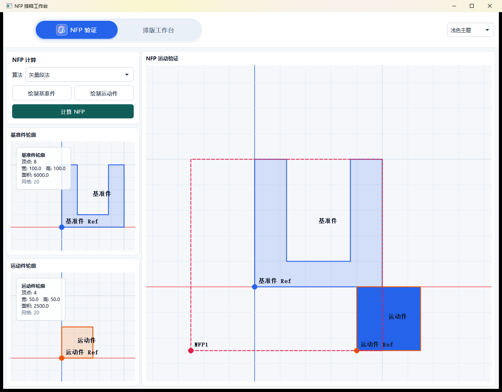
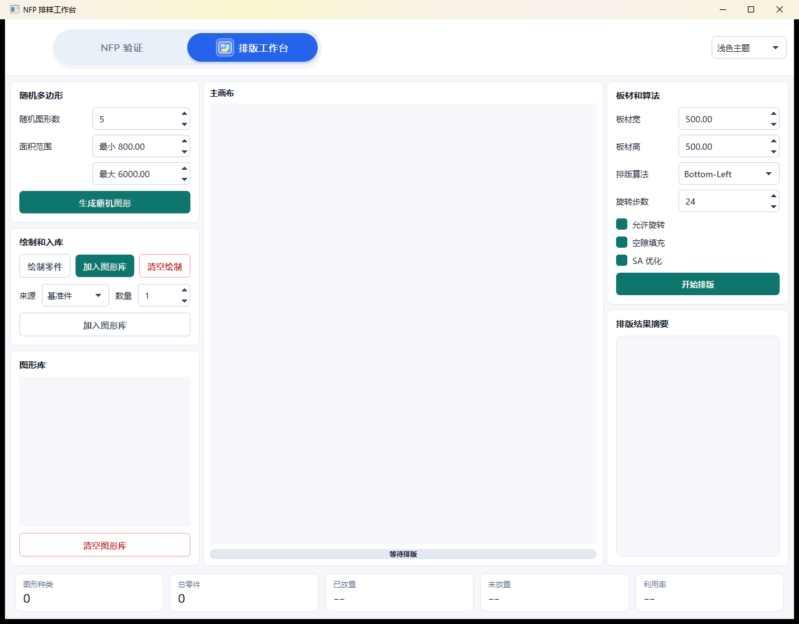

# QtCalcauteNFPs

QtCalcauteNFPs 是一个基于 Qt Widgets 的二维不规则零件 NFP 计算与排样验证工具。项目面向不规则多边形嵌套排样场景，提供 NFP 算法对比、运动验证动画、随机多边形生成、图形库管理和多零件排版工作台。

## 主要功能

- NFP 验证：分别绘制基准件和运动件，计算并展示临界多边形。
- 运动动画：沿 NFP 轨迹演示运动件绕基准件运动，并显示参考点位置。
- 多算法对比：支持移动碰撞法、矢量段法和 Minkowski 法。
- 排版工作台：维护图形库、设置零件数量、配置板材尺寸和旋转策略，并执行排版。
- 随机图形：按数量、顶点数和面积范围生成合法的随机凸/凹多边形。
- 结果展示：以卡片列表展示图形库和排版结果摘要，主画布显示最终放置结果。
- 调试输出：输出多边形顶点、NFP 耗时、矢量段统计和排版过程日志，便于复现问题。

## 界面预览

### NFP 验证



### 排版工作台



## NFP 算法

### 移动碰撞法

移动碰撞法从初始接触状态出发，持续寻找可行移动方向并推进运动件，最终形成 NFP 轨迹。该方法适合观察碰撞推进过程，也便于调试接触状态和碰撞判断。

### 矢量段法

矢量段法基于角度向量和边段组合生成候选轨迹线段，再对线段进行切分、连接和闭环提取。该方法尽量贴近论文中的临界多边形生成流程，目标是在保证凹多边形正确性的前提下减少重复碰撞检测。

核心流程：

```text
generateCandidateSegments
-> splitSegments
-> extractRings
-> finishNfpRings
```

### Minkowski 法

Minkowski 法使用 Clipper 的 `MinkowskiDiff` 生成结果，主要作为稳定对照算法。对于复杂凹多边形或调试矢量段法时，可以用它辅助判断 NFP 结果是否合理。

## 排版逻辑

排版工作台会先根据图形库和每个图形的数量展开零件列表，再按照面积、候选位置和旋转角度进行放置。当前流程包含：

1. 读取图形库中的原型多边形和数量。
2. 根据板材宽高、是否允许旋转、旋转步长生成候选放置状态。
3. 使用 NFP 判断零件之间的不可重叠区域。
4. 选择可行候选点并更新排版进度。
5. 可选执行模拟退火优化，尝试降低布局包络和改善结果。

## 源码结构

```text
.
├── main.cpp
├── widget.cpp / widget.h / widget.ui
├── nest/
│   ├── nfp_placer.h
│   ├── nfp_placer.cpp
│   ├── nfp_placer_common.h
│   ├── nfp_placer_moving.cpp
│   ├── nfp_placer_vector.cpp
│   ├── nfp_placer_minkowski.cpp
│   ├── nester*.cpp
│   └── clipper/
├── shapes/
│   ├── s_point.hpp
│   ├── s_polyline.hpp
│   ├── s_box.hpp
│   └── utiltool.h
├── view/
│   ├── myctrlview.*
│   ├── nestcanvasview.*
│   ├── segmentedtabbar.*
│   └── kwctrlview.*
├── resources/
│   ├── icons.qrc
│   ├── style.qss
│   └── style_dark.qss
```

## 构建环境

推荐环境：

- Qt 5.15.2 MinGW 64-bit
- MinGW 8.1.0
- C++17

PowerShell 构建命令：

```powershell
mkdir build-qt5
cd build-qt5
D:\Qt\5.15.2\mingw81_64\bin\qmake.exe ..\QtCalcauteNFPs.pro
D:\Qt\Tools\mingw810_64\bin\mingw32-make.exe -j4
```

Qt Creator 构建流程：

1. 使用 Qt Creator 打开 `QtCalcauteNFPs.pro`。
2. 选择 Kit，例如 `Desktop Qt 5.15.2 MSVC2019 64bit` 或 `Desktop Qt 5.15.2 MinGW 64-bit`。
3. 首次打开或修改 `.pro` 后，执行 `Build > Run qmake`。
4. 执行 `Build > Build Project "QtCalcauteNFPs"`。
5. 运行项目时，直接点击 Qt Creator 的运行按钮。

新增或删除 `.cpp` 文件后，需要重新运行 qmake 生成 Makefile。

## 调试建议

计算 NFP 或执行排版时，程序会在 Qt 调试输出中打印关键数据：

- P1、P2 顶点数量和坐标。
- 当前 NFP 算法名称和耗时。
- 矢量段法候选线段数、切分后线段数、闭环数量和阶段耗时。
- 排版零件数量、排序结果、放置位置、旋转角度和利用率。

提交问题时建议附上完整顶点输出、所选算法、旋转配置和排版参数，这样可以直接复现对应几何状态。
